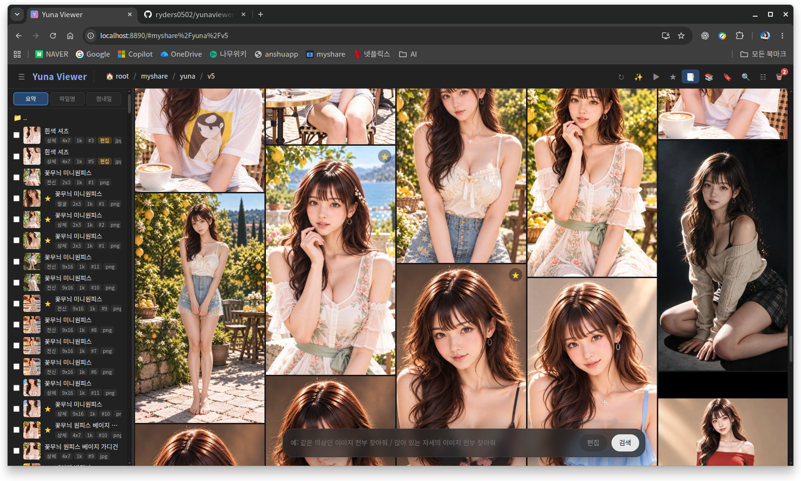

# Yuna Viewer

자연어 검색, AI 색인과 이름 정리, 얼굴·체형 보정과 부분 지우기까지 되는 로컬 AI 사진 뷰어입니다.
브라우저로 `localhost`에 접속해서 씁니다. 사진은 내 PC에 그대로 있고, AI 분석이 필요한 기능을 직접 실행할 때만 Gemini로 전송됩니다.



## 주요 기능

### 보기와 정리
- 폴더 목록과 썸네일 그리드(날짜순, 비율 유지), 원본 크기 뷰어(휠 확대·드래그 이동)
- 파일 리스트 보기 3가지: 파일명을 한글로 풀어 쓴 요약, 원래 파일명, 미니 썸네일
- 즐겨찾기, 별점(1~5)과 메모, 편집본을 원본 밑에 묶어 보기
- 휴지통(되돌리기, 복원, 선택 영구 삭제, 비우기), 폴더 이동
- 자동 앨범(의상·헤어·자세), 스마트 앨범(방향·즐겨찾기·별점·메모·파일명·AI 설명 조건, 한글 검색 가능)
- 중복·비슷한 사진 찾기와 베스트 컷 추천(선명도·눈 뜸·노출을 로컬에서 비교)
- 2~4장 나란히 비교(확대·이동 동기화), 슬라이드쇼
- AI 생성 정보 보기: ComfyUI·Stable Diffusion WebUI가 파일에 남긴 프롬프트, 모델, 시드 표시와 복사

### AI 기능 (Gemini, 요청할 때만 전송)
- 자연어 검색: "같은 의상인 이미지 전부 찾아줘", "앉아 있는 자세만", "그중 흰 옷만" 같은 이어서 검색
- 선택한 사진에 대한 질문: "첫번째와 두번째 인물이 얼마나 비슷해?"
- AI 색인 + 이름 정리: 사진을 설명해 두고 `폴더_의상_범위_비율_해상도_번호` 형식으로 이름을 붙임(미리보기 후 적용, 되돌리기 가능)
- 편집 명령: "밝기 조금 올려줘", "허벅지 살짝 두껍게", "코를 작게", "턱선 갸름하게"

### 편집 (원본은 바꾸지 않고 `_edit` 사본으로 저장)
- 자르기·늘리기·회전·반전, 밝기·대비·채도·감마·색온도·선명도, AI 자동 보정
- 배경 흐림·제거
- 얼굴만 밝기·톤·피부 보정, 얼굴 형태(코·눈·입술·턱선, 얼굴이 크게 나온 사진만)
- 체형 보정(팔·다리 길이와 두께, 가슴·허리·골반 폭 등, MediaPipe 기반)
- 부분 지우기: 붓으로 칠한 잡티나 자국을 주변으로 메움(OpenCV)
- 실행 취소/다시 실행, 전후 비교 슬라이드바, 여러 장에 같은 설정 일괄 적용

## 요구 사항

- Python 3.14 (개발 환경 기준)
- Gemini API 키(무료 tier로 동작). AI 기능을 쓰지 않으면 없어도 보기·정리·로컬 편집은 됩니다.
- Linux에서 개발·테스트했습니다.

## 설치

```bash
git clone git@github.com:ryders0502/yunaviewer.git
cd yunaviewer
python3 -m venv .venv
.venv/bin/pip install -r requirements.txt
cp yunaviewer.cfg.example yunaviewer.cfg
```

`yunaviewer.cfg`를 열어서 Gemini API 키와 사진 폴더를 넣습니다.

```ini
[server]
root = ~/Pictures          # 사진 루트 폴더
host = 127.0.0.1
port = 8890

[llm]
gemini_api_key = 여기에_키  # GEMINI_API_KEY 환경변수가 있으면 그쪽이 우선
```

`yunaviewer.cfg`에는 API 키가 들어가므로 `.gitignore`로 제외돼 있습니다. 커밋하지 마세요.

체형·얼굴 보정용 MediaPipe 모델(약 33MB)은 처음 사용할 때 `models/`에 자동으로 내려받습니다.

## 실행

```bash
./yunaviewer.sh start            # 설정 파일의 root로 시작
./yunaviewer.sh start ~/사진폴더  # 다른 폴더로 시작
./yunaviewer.sh status | stop | restart | log
```

브라우저에서 <http://localhost:8890> 에 접속합니다. 마지막으로 열었던 폴더에서 다시 시작합니다.

루트 바로 아래에 둔 폴더 심볼릭 링크는 라이브러리 폴더로 취급되어 함께 보입니다.

## 단축키

| 위치 | 키 | 동작 |
|---|---|---|
| 목록 | `/` | 프롬프트 입력 |
| 뷰어 | `←` `→` | 이전/다음 사진 |
| 뷰어 | `↑` `↓` | 원본/편집본 전환 |
| 뷰어 | `Space` | 선택 |
| 뷰어 | `F` | 즐겨찾기 |
| 뷰어 | `1`~`5`, `0` | 별점, 지우기 |
| 뷰어 | `P` | 슬라이드쇼 |
| 뷰어 | `E` | 편집 |
| 뷰어 | `I` | 이미지 정보 |
| 뷰어 | `Del` | 휴지통 |
| 프롬프트 | `↑` `↓` | 이전 프롬프트 (검색과 편집 기록은 따로) |
| 편집기 | `Ctrl+Z` / `Ctrl+Shift+Z` | 실행 취소 / 다시 실행 |

## 개인정보와 데이터

- 폴더를 열거나 앨범·중복 찾기를 할 때는 아무것도 전송하지 않습니다. 사진은 AI 색인, AI 검색, 질문, 자동 보정처럼 직접 실행한 기능에서만 Gemini로 전송되고, 아직 분석하지 않은 사진이 있으면 먼저 묻습니다.
- 편집 명령은 사진 없이 글자만 보냅니다. 체형·얼굴 보정, 부분 지우기, 베스트 컷은 모두 로컬에서 처리합니다.
- 색인, 즐겨찾기, 별점·메모, 썸네일, 휴지통은 사진 루트의 `.yunaviewer/` 폴더에 저장됩니다. 즐겨찾기·별점·AI 설명은 파일 내용 기준이라 이름을 바꾸거나 옮겨도 따라갑니다.

## 구성

| 파일 | 역할 |
|---|---|
| `server.py` | HTTP 서버, 편집 파이프라인, 검색·색인·이름 정리 |
| `library.py` | 즐겨찾기·별점, 휴지통·이동·이름 변경(되돌리기), 앨범, 중복, AI 생성 정보 |
| `effects.py` | 배경, 얼굴 톤·형태, 베스트 컷 점수, 부분 지우기 |
| `body_edit.py` | MediaPipe 자세·얼굴 인식과 체형 보정 |
| `search_agent.py` | Gemini 호출(Strands Agents), 모드별 프롬프트와 구조화 출력 |
| `index.html` | 화면 전체(단일 파일, 빌드 없음) |

## 테스트

```bash
.venv/bin/python test_server.py
.venv/bin/python test_library.py
.venv/bin/python test_effects.py
.venv/bin/python test_body_edit.py
```

AI 호출은 테스트에서 가짜 응답으로 대체되므로 API 키 없이 돌릴 수 있습니다.
